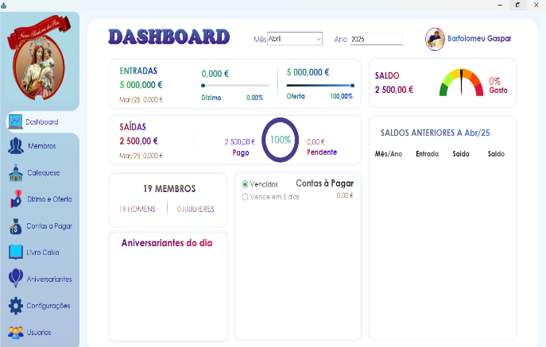

# SGI - Sistema de Gestão de Igreja

<div align="center">
  
</div>


## 📋 Sobre o Projeto

O **SGI (Sistema de Gestão de Igreja)** é uma aplicação desktop desenvolvida em C# com Windows Forms, projetada para auxiliar na administração e gestão de atividades eclesiásticas. O sistema oferece uma interface moderna e intuitiva para o gerenciamento completo das operações de uma igreja.

## 🚀 Funcionalidades Principais

- **Sistema de Autenticação**: Login seguro com criptografia de senhas
- **Gestão de Usuários**: Controle de acesso e permissões
- **Interface Moderna**: Controles customizados com design responsivo
- **Relatórios**: Sistema de relatórios integrado com ReportViewer
- **Conectividade**: Integração completa com banco de dados MySQL
- **Validações**: Sistema robusto de validação de dados
- **Busca Avançada**: Funcionalidades de pesquisa e filtros

## 🛠️ Tecnologias Utilizadas

### Framework e Linguagem
- **.NET 8.0** - Framework principal
- **C#** - Linguagem de programação
- **Windows Forms** - Interface gráfica

### Banco de Dados
- **MySQL 9.3.0** - Sistema de gerenciamento de banco de dados
- **MySql.Data** - Conector oficial MySQL para .NET

### Bibliotecas e Dependências
- **ReportViewerCore.WinForms 15.1.26** - Geração de relatórios
- **Newtonsoft.Json 13.0.3** - Manipulação de JSON
- **BouncyCastle.Cryptography 2.6.1** - Criptografia avançada
- **Google.Protobuf 3.31.1** - Serialização de dados
- **ZstdSharp.Port 0.8.5** - Compressão de dados

## 📁 Estrutura do Projeto

```
SGI_Igreja/
├── 📁 Codigos/              # Classes de negócio e utilitários
│   ├── APIs.cs              # Integração com APIs externas
│   ├── BuscaCEP.cs          # Consulta de CEP
│   ├── BuscaCNPJ.cs         # Consulta de CNPJ
│   ├── Config.cs            # Configurações do sistema
│   ├── Funcoes.cs           # Funções auxiliares e utilitários
│   ├── GRID.cs              # Manipulação de grids
│   └── MYSQL.cs             # Camada de acesso a dados
├── 📁 Controles/            # Controles customizados
│   ├── ECTurbo_Botao.cs     # Botões personalizados
│   ├── ECTurbo_TextBox.cs   # Caixas de texto customizadas
│   ├── ECTurbo_ComboBox.cs  # ComboBox personalizado
│   └── [outros controles]   # Diversos controles UI
├── 📁 Formularios/          # Formulários da aplicação
│   ├── FrmLogin.cs          # Tela de login
│   ├── FrmPrincipal.cs      # Formulário principal
│   ├── FrmConexaoMySQL.cs   # Configuração de conexão
│   └── [outros forms]       # Outros formulários
├── 📁 LinhasModeloGRID/     # Modelos para grids
├── 📁 Properties/           # Propriedades do projeto
└── Program.cs               # Ponto de entrada da aplicação
```

## ⚙️ Pré-requisitos

### Sistema Operacional
- **Windows 10** ou superior
- **.NET 8.0 Runtime** instalado

### Banco de Dados
- **MySQL Server 8.0** ou superior
- **MySQL Workbench** (recomendado para administração)

### Desenvolvimento
- **Visual Studio 2022** (versão 17.10 ou superior)
- **MySQL Connector/NET**

## 🔧 Instalação e Configuração

### 1. Clone o Repositório
```bash
git clone [URL_DO_REPOSITORIO]
cd SGI-Igreja
```

### 2. Configuração do Banco de Dados
1. Instale o MySQL Server
2. Crie um banco de dados para o sistema
3. Execute os scripts de criação das tabelas (se disponíveis)

### 3. Configuração da Aplicação
1. Abra o projeto no Visual Studio
2. Restaure os pacotes NuGet:
   ```
   dotnet restore
   ```
3. Configure a string de conexão no primeiro acesso da aplicação

### 4. Compilação
```bash
dotnet build --configuration Release
```

## 🚀 Como Executar

### Desenvolvimento
1. Abra o projeto no Visual Studio
2. Pressione `F5` ou clique em "Iniciar Depuração"

### Produção
1. Navegue até a pasta `bin/Release/net8.0-windows/`
2. Execute o arquivo `SGI_Igreja.exe`

## 🔐 Primeiro Acesso

1. **Configuração de Conexão**: Na primeira execução, configure a conexão com o banco MySQL
2. **Login**: Use as credenciais padrão do administrador (consulte a documentação interna)
3. **Configuração Inicial**: Complete a configuração inicial do sistema

### Atalhos Especiais
- **Ctrl+Shift+Alt+B**: Abre a configuração de conexão do banco de dados

## 📊 Funcionalidades Detalhadas

### Sistema de Autenticação
- Login com usuário e senha
- Criptografia de senhas com algoritmos seguros
- Controle de sessão de usuário
- Recuperação de senha

### Controles Personalizados
- **ECTurbo_Botao**: Botões com design moderno
- **ECTurbo_TextBox**: Campos de texto com validação
- **ECTurbo_ComboBox**: Listas suspensas customizadas
- **ECTurbo_CheckBox**: Caixas de seleção estilizadas
- **ECTurbo_Grafico**: Componentes para visualização de dados

### Integração com APIs
- **Busca de CEP**: Integração com serviços de consulta de endereço
- **Consulta de CNPJ**: Validação e busca de dados empresariais

## 🔧 Configurações Avançadas

### Arquivo de Configuração (App.config)
```xml
<userSettings>
    <SGI_Igreja.Properties.Settings>
        <setting name="MySQL_BD" serializeAs="String">
            <value>[NOME_DO_BANCO]</value>
        </setting>
        <setting name="MySQL_Servidor" serializeAs="String">
            <value>[SERVIDOR]</value>
        </setting>
        <setting name="MySQL_Porta" serializeAs="String">
            <value>[PORTA]</value>
        </setting>
    </SGI_Igreja.Properties.Settings>
</userSettings>
```

## 🐛 Solução de Problemas

### Problemas Comuns

**Erro de Conexão com MySQL**
- Verifique se o MySQL Server está executando
- Confirme as credenciais de acesso
- Teste a conectividade de rede

**Erro de Dependências**
- Execute `dotnet restore` para restaurar pacotes
- Verifique se o .NET 8.0 está instalado

**Problemas de Performance**
- Otimize as consultas SQL
- Verifique índices no banco de dados
- Monitore o uso de memória

## 📈 Roadmap

- [ ] Migração para .NET 9.0
- [ ] Interface web complementar
- [ ] API REST para integração
- [ ] Módulo de relatórios avançados
- [ ] Backup automático
- [ ] Sincronização em nuvem

## 🤝 Contribuição

Para contribuir com o projeto:

1. Faça um fork do repositório
2. Crie uma branch para sua feature (`git checkout -b feature/AmazingFeature`)
3. Commit suas mudanças (`git commit -m 'Add some AmazingFeature'`)
4. Push para a branch (`git push origin feature/AmazingFeature`)
5. Abra um Pull Request

## 📝 Licença

Este projeto é proprietário. Todos os direitos reservados.

## 📞 Suporte

Para suporte técnico ou dúvidas sobre o sistema:

- **Email**: [bartolomeugasparbg@gmail.com]
- **Telefone**: [921389141]
- **Documentação**: [link-para-documentacao]

## 📋 Changelog

### Versão Atual
- Sistema de login implementado
- Controles customizados funcionais
- Integração com MySQL estável
- Sistema de relatórios básico

---

**Desenvolvido com ❤️ para a gestão eclesiástica moderna**
